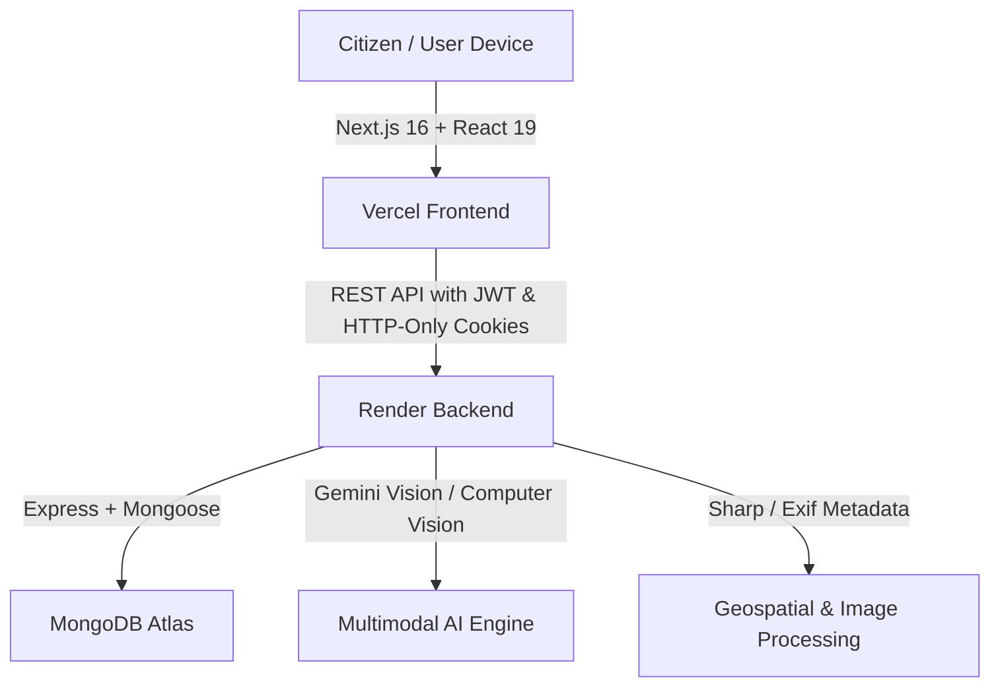

# CleanMysuru AI 🌿🏛️

> **Next-Generation Civic Waste Intelligence & Urban Sanitation System for Mysuru City**

---

## 🚀 Key Links & Project Deliverables

| Deliverable | Resource / Link | Description |
| :--- | :--- | :--- |
| 🌐 **Live Web Application** | **[https://cleanmysuru-ai-rfcj.vercel.app/](https://cleanmysuru-ai-rfcj.vercel.app/)** | Deployed production  on Vercel |
| 📊 **Project Presentation (PPT)** | **[`cleanai.ppt`](./cleanai.ppt)** / **[`cleanmysuru.ai.pptx`](./cleanmysuru.ai.pptx)** | Complete slide deck detailing the vision, architecture, and impact |
| 🎥 **Demo Video Recording** | **[`recording.mp4`](./recording.mp4)** | Full end-to-end video walkthrough and demonstration |


---

## 🌟 Overview

**CleanMysuru AI** empowers citizens and municipal authorities (Mysuru City Corporation) to maintain Mysuru as India's cleanest heritage city. Leveraging multimodal AI, automated computer vision waste classification, geospatial validation, and municipal workflow tracking, CleanMysuru AI bridges the gap between civic reporting and rapid waste resolution.

### Core Capabilities:
1. **Citizen Reporting**: Fast photo/video upload with instant AI detection of waste severity, classification, and location tagging.
2. **AI Waste Classification**: Multimodal computer vision identifying waste categories (organic, dry, hazardous, construction & demolition).
3. **Geofenced Verification**: Bounded within Mysuru city limits with GPS extraction and distance validation.
4. **Municipal Command Dashboard**: Role-based workflow for civic officials to triage complaints, dispatch sanitization teams, track resolution, and confirm site cleanup with before/after photo verification.
5. **Transparency & Feedback**: Real-time status updates from complaint submission to final municipal confirmation.

---

## 🏗️ Architecture & Tech Stack



### Technology Stack:
- **Frontend**: Next.js 16 (Turbopack), React 19, Tailwind CSS, Lucide React, Framer Motion, Leaflet maps.
- **Backend**: Node.js, Express, Multer, Sharp, ExifR.
- **Database**: MongoDB Atlas with Mongoose ODM (structured schema for users, incidents, reviews, and audits).
- **Authentication**: Secure JWT tokens, BCrypt password hashing, Role-Based Access Control (Citizen, Municipal Official, Admin).
- **Deployment**:
  - Frontend: Vercel ([cleanmysuru-ai-rfcj.vercel.app](https://cleanmysuru-ai-rfcj.vercel.app/))
  - Backend: Render ([cleanmysuru-ai.onrender.com](https://cleanmysuru-ai.onrender.com))
  - Database: MongoDB Atlas Cloud Cluster

---

## 📁 Repository Structure

```
├── cleanai.ppt            # Project Presentation Slide Deck
├── cleanmysuru.ai.pptx    # High-resolution PowerPoint Presentation
├── recording.mp4          # Video demonstration of the application
├── app/                   # Next.js App Router (Pages, Layouts, UI Components)
├── backend/               # Production Express API
│   ├── src/
│   │   ├── config/        # Database & Environment configuration
│   │   ├── controllers/   # Auth, Incident, Health, and User controllers
│   │   ├── models/        # Mongoose database models
│   │   ├── routes/        # Express API endpoints
│   │   └── server.js      # Production server entrypoint
├── components/            # Reusable UI components
├── lib/                   # API clients and utility helpers
├── public/                # Static assets & icons
└── README.md              # Project documentation and submission links
```

---

## 🛠️ Local Development Setup

### 1. Prerequisites
- Node.js 18+ or 20+
- npm or pnpm
- MongoDB instance (local or MongoDB Atlas)

### 2. Clone the Repository
```bash
git clone https://github.com/sushanth1313/cleanmysuru-ai.git
cd cleanmysuru-ai
```

### 3. Frontend Setup
```bash
npm install
npm run dev
```
Open [http://localhost:3000](http://localhost:3000) in your browser.

### 4. Backend Setup
```bash
cd backend
npm install
npm run dev
```
Backend runs on [http://localhost:5000](http://localhost:5000).

---

## 🏆 HackMysuru 2026 Submission

- **Team**: CleanMysuru AI
- **Repository**: [https://github.com/sushanth1313/cleanmysuru-ai](https://github.com/sushanth1313/cleanmysuru-ai)
- **Live Demo**: [https://cleanmysuru-ai-rfcj.vercel.app/](https://cleanmysuru-ai-rfcj.vercel.app/)
- **Presentation**: Included as [`cleanai.ppt`](./cleanai.ppt)
- **Video Walkthrough**: Included as [`recording.mp4`](./recording.mp4)
